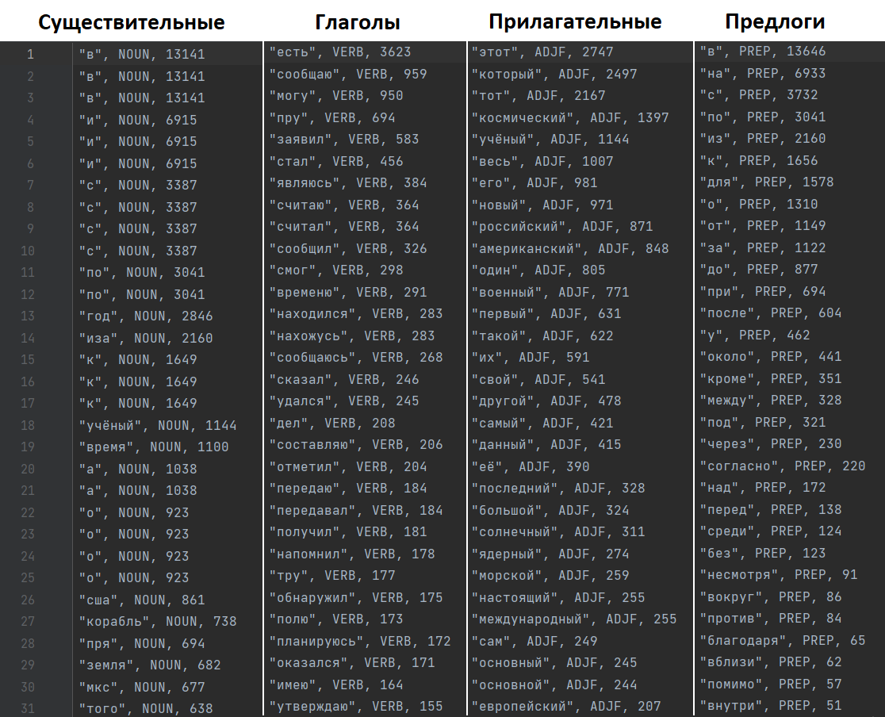

Для того, чтобы воспроизвести работу программы, нужно дополнительно положить файл `dict.opcorpora.xml` в директорию `task1/src/main/resources/`

XML-файл с словарём open corpora можно скачать сдесь: http://opencorpora.org/dict.php

Результат работы программы на входном корпусе `corps/dataset_news_science.txt` находится в файле `task1/src/main/resources/output.txt`

Фрагмент результирующей статистики по некоторым частям речи:
